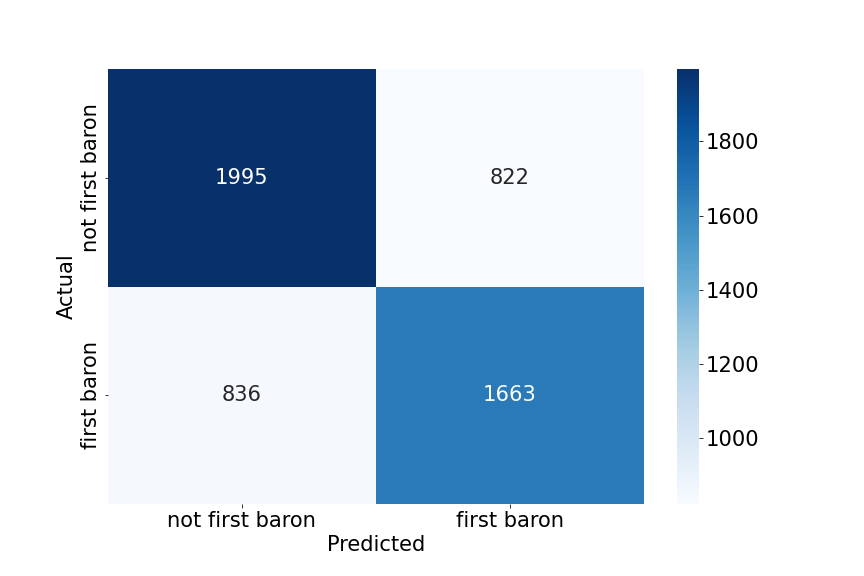

# Who gets the first baron?
*A classification analysis*
by Sawyer Figueroa (s2figuer@ucsd.edu)

--------------------------------------
## Framing the Problem
--------------------------------------
In this machine learning exploration, I will be performing a classification analysis using a dataset from Oracle’s Elixir 
which contains game data for all competitive League of Legend’s matches in 2022. The exploratory data analysis of this dataset 
can be found on another website here:

https://github.com/SM-Figueroa/LOL_champion_balance

The purpose of this classification analysis is to solve the following problem: can we predict which team kills the first baron in a match based on pre-game data and data from the first 15 minutes of that match? To solve this problem we will develop a binary classification model that, based on a 
set of features, outputs that a team in a given match either did or did not get the first baron. This corresponds to the column
labeled **firstbaron** in the dataset. It is worth noting that the baron spawns at 20 minutes into the game in each match so 
all the data we will be using a features (pre-15 minutes) will be known at the time of prediction. The metric that will be used 
to evaluate all models in this analysis is the F1-score. This metric was chosen because, in the case of this problem, we value 
both precision and recall equally and don't want inbalances in our dataset to affect the performance of our model as is often the 
case when soley using accuracy as a metric. Without further ado, let's start building the models.

-------------------------------------
## Baseline Model
-------------------------------------
The initial model trained in this analysis was a Random Forest Classifier. This classifier was trained on two initial features.
The first was a nominal feature labeled *playoffs* in the dataset which contains boolean values denoting whether or not a match was
a playoff match. The second feature was a quantitative feature labeled *golddiffat15* in the dataset, referring to the difference 
in gold (team - enemy team) between the two teams at 15 minutes into the game. Both of these features requried no encodings and were not 
transformed in any way before feeding them into the model. First, the data was split into training and test splits with a test size 
of 0.25 then the model was trained only on the training data. The resulting training, average cross-validation (5 folds), and test 
f1-scores were **0.862, 0.572, and 0.577** respectively. This baseline model shows great performance on the training data and performance that is barely above chance on the cross-validation and test data. This suggests that model is not very good in that it has overfit to the training data and 
is showing high variance in response to unseen data. In the next section we will create a new model to help with generalizability.

-------------------------------------
## Final Model
-------------------------------------
In the final model, I choose to include the following features in total: *playoffs*, *golddiffat15*, *side*, *xpdiffat15*, *csdiffat15*, 
*killsat15*, *assistsat15*, and *deathsat15*. The *playoffs* feature likely affects the outcome of our classifier because playoff games 
tend to be slower than season games and, in my opinion, likely increase the chance that baron is capture by a team at all. The other 
categorical metric *side* likely has an effect on who gets the first baron because teams that play on the red side are closer to the 
baron and therefore may have an advantage in capturing the first one. The quantitative features *golddiffat15*, *xpdiffat15*, and *csdiffat15* 
are all good measures of how powerful a team is compared to the enemy. More cs and gold correlates with more items which, along with xp, correlates 
with more powerful abilites and attacks, increasing the likelihood that a team will capture the first baron. Finally, the remaining quantitative
features *killsat15*, *assistsat15*, and *deathsat15* are again good indicators of not only how powerful a team is, but their fighting ability 
in the current match.

Again, the classification model used in this analysis was a Random Forest Classifier. The categorical columns *playoffs* and *side* were 
transformed using One Hot Encoding, dropping the first category. The quantitative features *golddiffat15*, *xpdiffat15*, and *csdiffat15* are all values with wildy different means and variations so they were transformed using a Standard Scaler. Finally, the remaining features features *killsat15*, *assistsat15*, and *deathsat15* were aggregated using a Function Transformer to create a singular *kda* value. The results of all of these transformations were passed into the Random Forest Classifier which produced training, average cross-validation (5 folds), and test f1-scores of 
**1.0, 0.659, and 0.648** respectively.

To improve the model's accuracy, hyperparameter tuning was conducted using sklearn's GridSearchCV. The following hyperparameter combinations were 
tested:

`hyperparameters = {
                       'random_forest__max_depth': [3, 5, 10, None],
                       'random_forest__max_features': ['auto', 'sqrt'],
                       'random_forest__min_samples_leaf': [1, 2, 4],
                       'random_forest__min_samples_split': [2, 5, 10],
                       'random_forest__n_estimators': [230, 300, 350]}`
            
The hyperparameters that minimized the average cross-validation f1-score (5 folds) across all combinations were as follows:

`{'random_forest__max_depth': 5,
 'random_forest__max_features': 'auto',
 'random_forest__min_samples_leaf': 4,
 'random_forest__min_samples_split': 10,
 'random_forest__n_estimators': 350}`
 
When retraining the model on the training set the resulting training, average cross-validation (5 folds), and test f1-scores were **0.687, 0.681, 
and 0.667** respectively. The f1-score on the cross-validation and test set improved by nearly 0.1 from the baseline model. Initially, the final model was grossly overfit, getting a perfect f1-score on the training dataset, but with hyperparameter tuning where the max depth of each tree in the forest was decreased to 5 and the number of trees was increased to 350, the f1-score of the model increased on unseen data and decreased substantially on the training data to a more reasonable score.

Below is a confusion matrix showing the performance of the final model on the testing set:

----------------------------------------
## Fairness Analysis
----------------------------------------
Now we'll test to see if our model can classify whether or not a team got the first baron in a match equally well for teams on the red side and 
teams on the blue side. As in our previouis analysis, the metric we will use is the F1-score. We will perform a permutation test between the two
groups to see if the F1-scores of red and blue side teams come from the same distribution.

Null Hypothesis: The model is fair. The f1 score for teams playing on red side versus blue side are roughly the same and differences between 
them are due to random chance

Alternative Hypothesis: The model is unfair. The f1 score for teams playing on the red side is higher than the F1-score for teams playing on 
the blue side. The difference in f1 scores (red-blue) is greater than observed based on random chance.

The test statistic used in this permuatation is the difference (red - blue) in F1-scores between the two groups. We will conduct this test with a 
significance level of 0.05.

<iframe src="assets/fairness_perm_test.html" width=800 height=600 frameBorder=0></iframe>

The resulting p-value from this permutation test is **0.552** meaning we fail to reject the null hypothesis at the 0.05 significance level. Therefore 
we cannot conclude that the model's ability to classify whether or not a team got the first baron is unfairly distributed across the teams playing 
on red and blue sides of the map.

# FIN.
